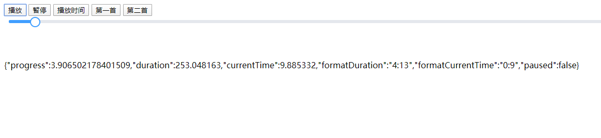

# 初始化
```
	var myAudio = new audiojs({
		// el:audioElement,可选
		loop: "order",
		playIndex: 0,
		list: ["生命中只要有你.mp3", "./Peter Roe - Last Reunion (Epicmusicvn Series).mp3"],
		callback: function (obj) {

			slider__bar.style.width = obj.progress + "%";
			slider__button.style.left = obj.progress + "%";

			if (obj.paused) {//设置暂停

			} else {//设置播放样式

			}
		}
	});

```
初始化选项
```
el:audioElement（可选）audio元素
	

loop:"order"（可选）播放顺序
	order:顺序播放，
	once:仅播放一首，
	loop:循环列表,

playIndex:0（可选）播放到第几首，从0开始

list:[] (可选) 音乐列表

callback:function(obj){} （可选）回调函数

	obj：{
			progress: progress,//百分比进度值，播放完成=100
			duration: _this.duration,//总时间（秒）
			currentTime: _this.currentTime,//当前播放时间（秒）

			formatDuration: _this.formatDuration,//总时间（字符串，分）,自定义的话可以更改format函数
			formatCurrentTime: _this.formatCurrentTime,//当前播放时间（字符串，分）,自定义的话可以更改format函数

			paused: _this.el.paused,//是否暂停
	}
	
```


# 实例属性

``var myAudio= new audiojs({});``

```
myAudio.el （可选）audio元素

myAudio.duration //总时间
// 0
myAudio.currentTime//播放时间
// 0

myAudio.formatDuration //格式化后的总时间 （通过覆盖myAudio.format函数自定义格式）
// "0:00"
myAudio.formatCurrentTime //格式化后的播放时间
// "0:00"

myAudio.playIndex //播放到第几首，从0开始 （可写）
// 0

myAudio.list //音乐列表（可写）
// []

myAudio.loop //播放顺序（可写）
// order


```

# 实例方法
```
myAudio.setCurrentTime(10) //设置从第十秒播放

myAudio.play(playIndex) //开始播放
	myAudio.play(1) //从第二首开始播放
	myAudio.play() //继续播放

myAudio.pause() //暂停
```